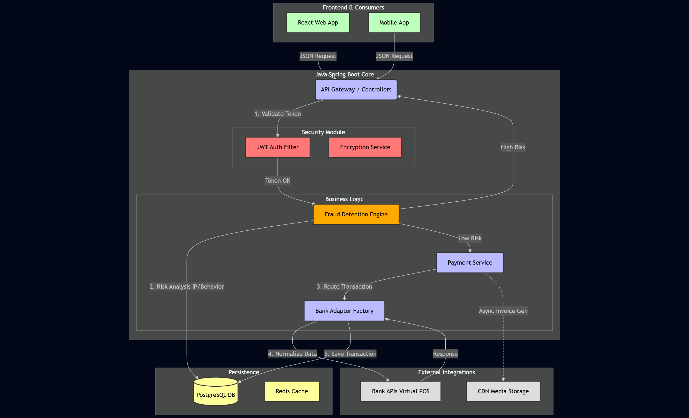

# 🛡️ Enterprise Payment Gateway API (Mock)

A robust, production-grade Payment API simulation built with **Java Spring Boot**, designed to handle secure transactions, fraud detection, and 3D Secure simulations. This project demonstrates an end-to-end fintech architecture capable of processing high-volume financial data securely.

## 🚀 Key Features

* **Secure Transactions:** Implements end-to-end encryption and **JWT-based authentication** to ensure secure client-server communication.
* **Fraud Detection Engine:** A sophisticated logic layer that analyzes transaction patterns (IP geolocation, frequency, amount anomalies) to flag and block suspicious activity in real-time.
* **Bank Simulation (Mock Adapter):** Simulates real-world banking latency and diverse response codes (e.g., `200 OK`, `402 Insufficient Funds`, `408 Request Timeout`) to test system resilience.
* **3D Secure Flow:** Handles OTP (One-Time Password) verification logic for high-risk transactions.
* **Scalable Architecture:** Designed with **Redis** caching for high performance and **PostgreSQL** for reliable data persistence.

## 🛠️ Tech Stack

* **Backend Framework:** Java 17, Spring Boot 3
* **Security:** Spring Security, JWT (JSON Web Token)
* **Database:** PostgreSQL (Relational Data), Redis (Caching layer)
* **Testing:** JUnit 5, Mockito (Unit & Integration Tests)
* **Documentation:** Swagger UI (OpenAPI 3.0)
* **Tools:** Docker, Maven, Git

## 🏗️ System Architecture

Here is the high-level architecture of the payment processing flow, showcasing the integration between the Security Layer, Fraud Engine, and External Bank Adapters.



### Architectural Highlights:
1.  **Security Layer:** All incoming requests are intercepted by the **JWT Auth Filter** for validation before reaching the business logic.
2.  **Fraud Engine:** Acts as a gatekeeper; transactions with a high-risk score are rejected immediately, protecting downstream services.
3.  **Bank Adapter Factory:** Uses the **Adapter Design Pattern** to normalize responses from different bank APIs into a single standard format.

## 🔌 API Documentation (Swagger)

The project includes fully interactive API documentation. Once the application is running, you can test endpoints directly via the Swagger UI.

* **Local URL:** `http://localhost:8080/swagger-ui.html`
* **Key Endpoints:**
    * `POST /api/auth/login` - Authenticate and receive JWT.
    * `POST /api/payment/pay` - Initiate a transaction.
    * `GET /api/payment/status/{id}` - Check transaction status.

## 📦 How to Run

1.  **Clone the repository:**
    ```bash
    git clone [https://github.com/your-username/payment-api.git](https://github.com/your-username/payment-api.git)
    ```
2.  **Configure Database:**
    Update `src/main/resources/application.properties` with your PostgreSQL credentials.
3.  **Build and Run:**
    ```bash
    mvn clean install
    mvn spring-boot:run
    ```

---
*This project is designed for educational and portfolio purposes to demonstrate enterprise-level backend architecture.*
